# **T02: DPR: còpies de seguretat. Cas pràctic**

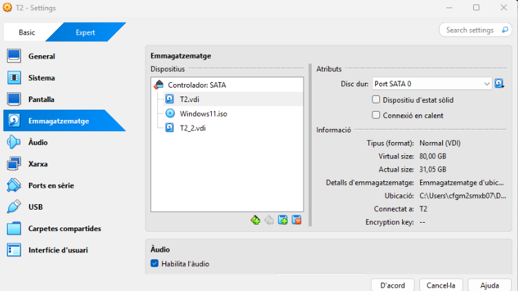

Primer crearem una màquina virtual a la qual li afegirem un disc de 10 GB que servirà per emmagatzemar les copiés de seguretat.

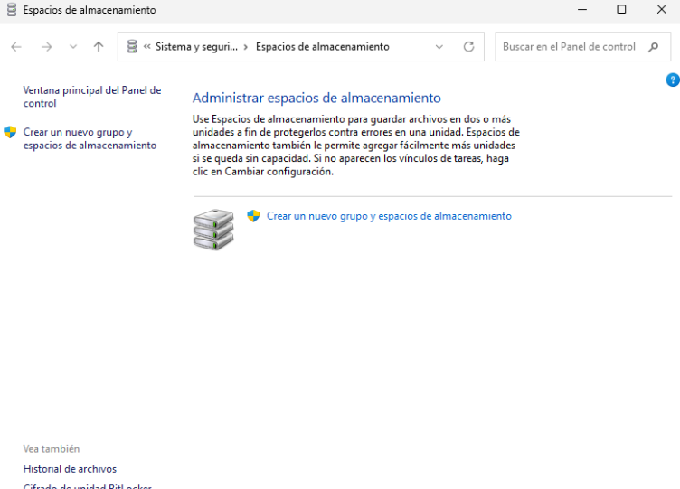
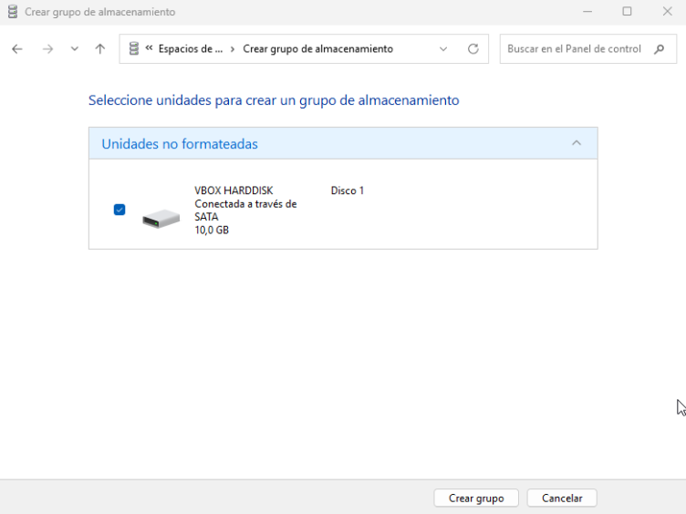
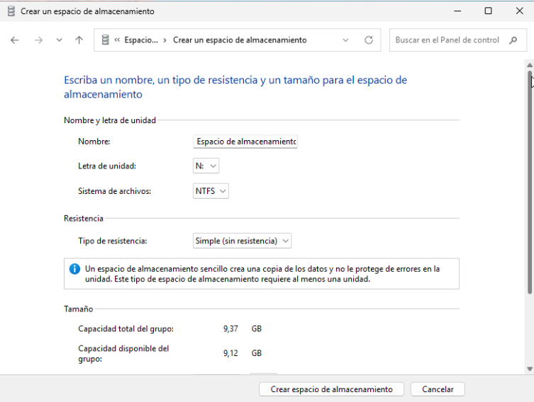

Després anirem a administrar espais d'emmagatzematge, crearem un grup d’emmagatzematge, creem el grup i creem l’espai d'emmagatzematge.

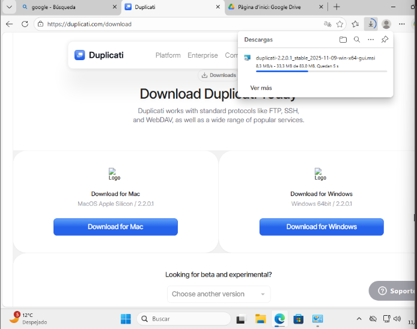

Instal·lem duplicati.

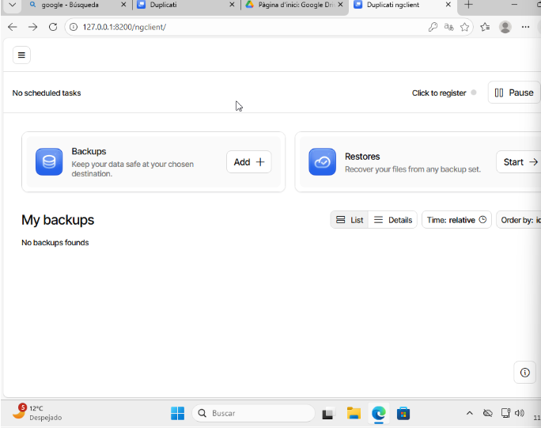

I creem les còpies de seguretat

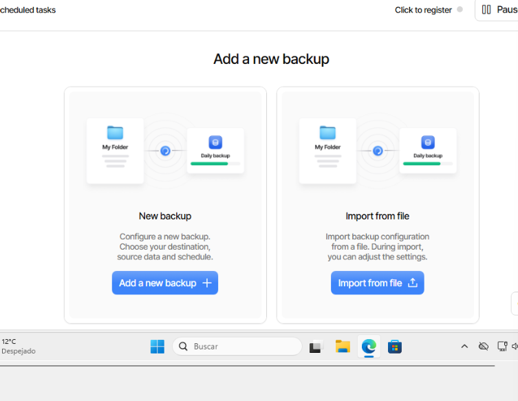

Posem nom a la còpia de seguretat, la descripció i la contrasenya.

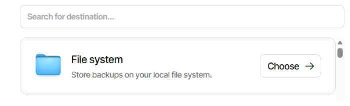

Després clicarem l’opció de file system

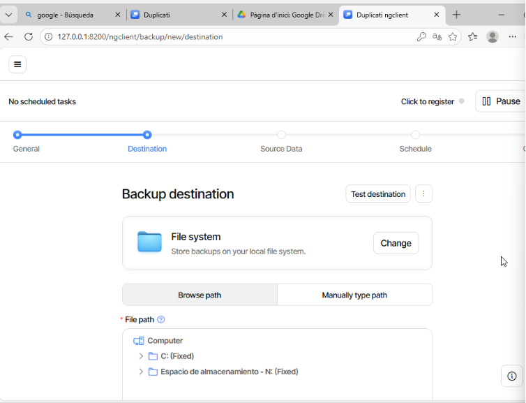

Escollirem el disc secundari,

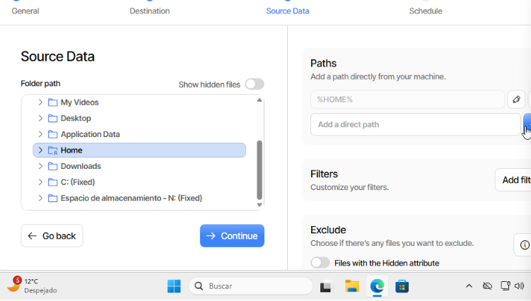

Després escollim la carpeta que volem copiar, en el nostre cas Home, on tenim documents,
downloads etc.

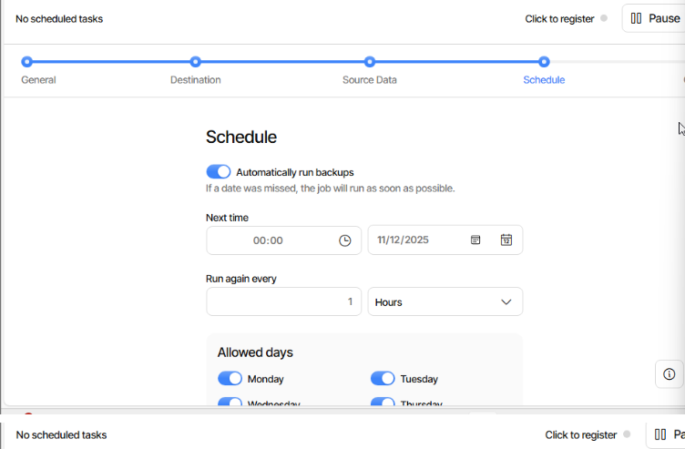
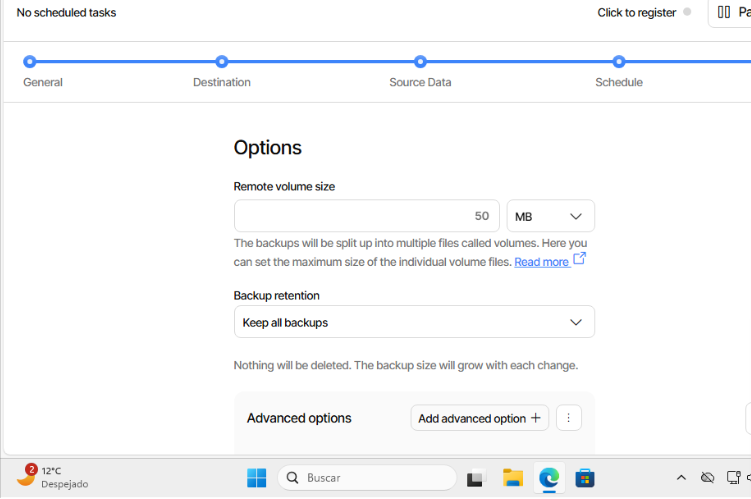

En aquest apartat s’estableix que les còpies de seguretat es facin cada hora i es desin al disc secundari, a l’apartat Options es deixa activada l’opció Keep all backups perquè no s’esborri cap còpia, finalment, es prem Submit, però abans cal registrar-se perquè el sistema ho permeti.

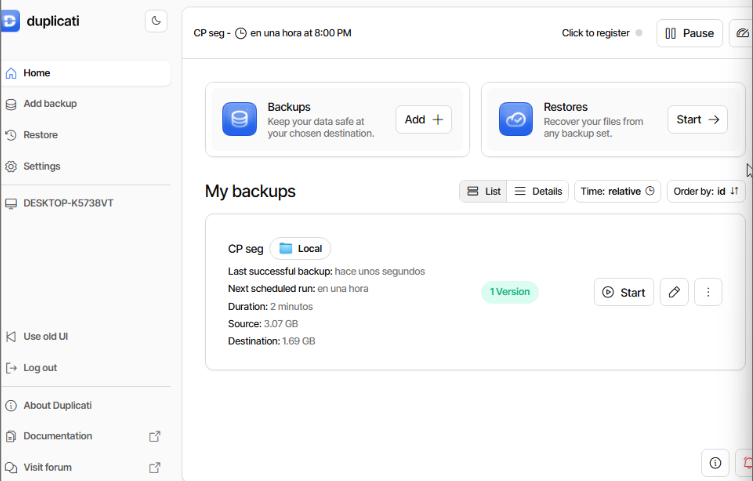

Un cop creat, afegirem arxius a les carpetes de l’usuari, especialment documents, després farà les còpies corresponents en els moments corresponents al lloc el funcionament.

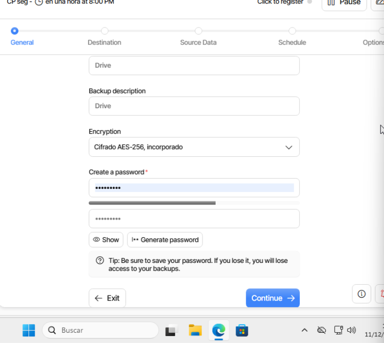

Ara creem l'altra còpia de seguretat, pel Drive, després posem un altre cop nom a la còpia de seguretat una descripció i una contrasenya.

Però ara cliquem l’opció de Drive en comptes de file system.

Tornem a escollir una carpeta.

Aquí indicarem que les còpies de seguretat es faran cada dia a les 18:00 i es desaran al Drive. A l’apartat Options mantindrem activada l’opció Keep all backups perquè no s’esborri cap còpia. Finalment, només cal prémer Submit per confirmar la configuració.

Cal generar un AuthID perquè la còpia de seguretat al Drive funcioni quan es prem Start i apareix un error, s’obre l’enllaç que mostra la notificació, es copia el text que apareix al navegador i s’enganxa a l’apartat AuthID dins de Destination a la configuració del backup. Un cop fet això, la còpia ja funcionarà correctament.

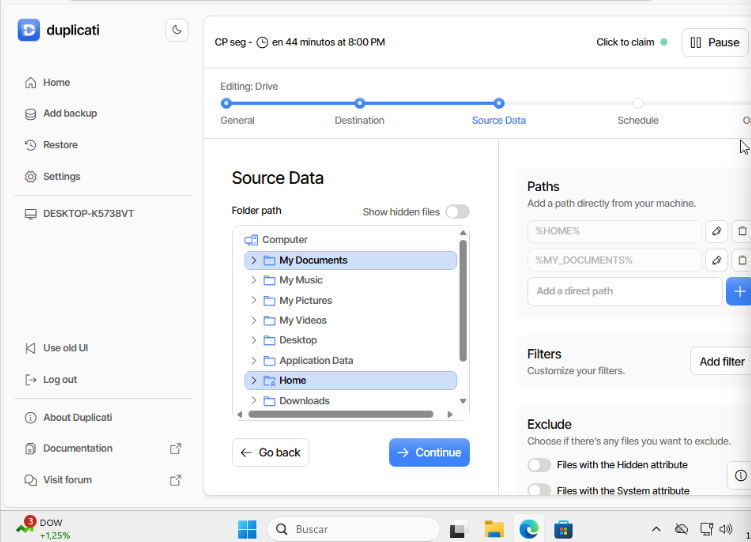

Un cop creat, afegirem arxius a les carpetes de l’usuari, especialment a documents, després farà les còpies corresponents en corresponents al lloc el funcionament.
Després els esborrem, per fer la comprovació

Després farem la Restauració des del disc secundari, anirem a restore i escollim l'opció de còpia de seguretat disc secundari i cliquem en restore.

Hem de seleccionar els fitxers, i confirmem correctament, i li donarem a continue.

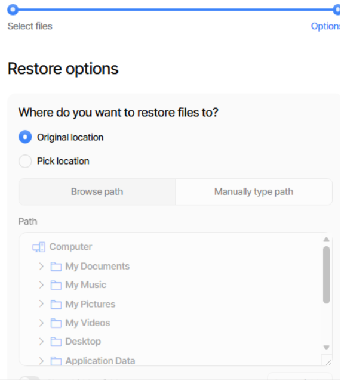

Original location i Overwrite. I Ssubmit

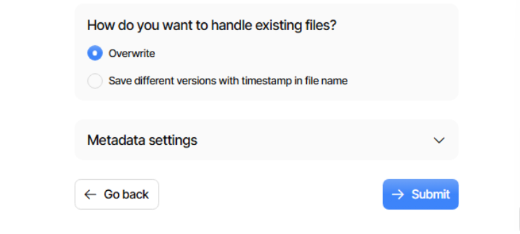

I la restauració estaria completada i en teoria ja se'ns haurien recuperat els arxius

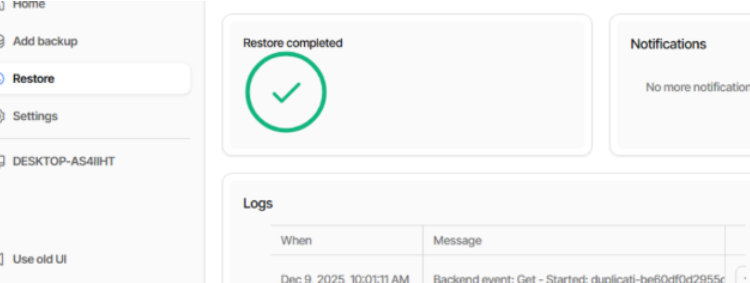

I les còpies de seguretat que crea duplicati apareixeran tant al disc secundari com al Google Drive en forma d’arxius encriptats, si entrem al Google Drive, podem veure aquests fitxers generats pel programa

