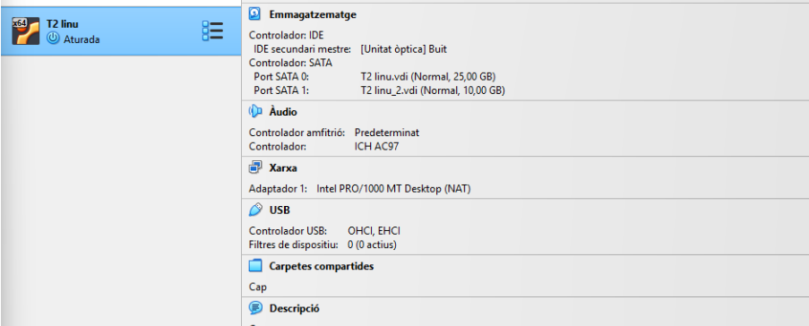
Primer creem el segon disc de 10 GB

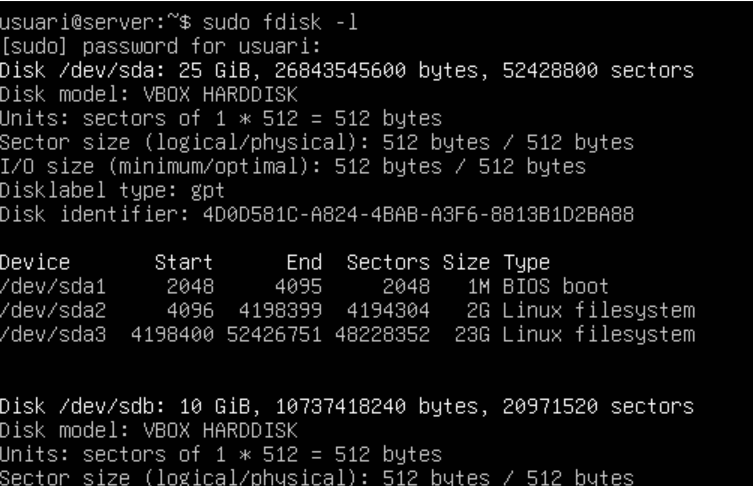

Entrem a la màquina Linux i comprovem que detecta el segon disc amb la següent comanda

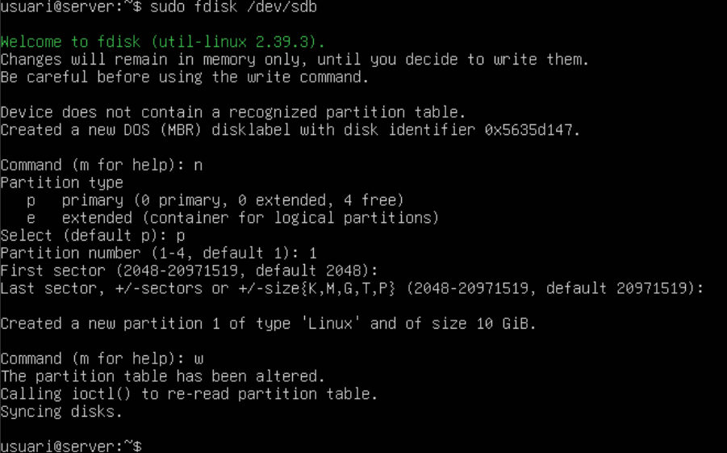

Ara crearem una partició nova en el segon disc de 10GB, posarem primer N nova partició, P partició primària, deixarem els valors per defecte i per últim W per guardar.

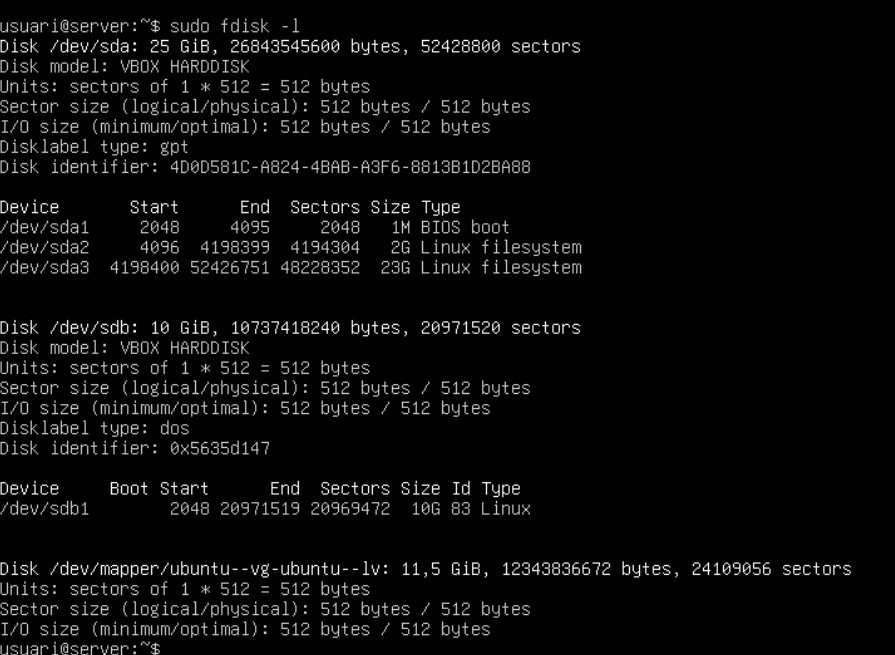

Comprovarem si s'ha creat correctament.

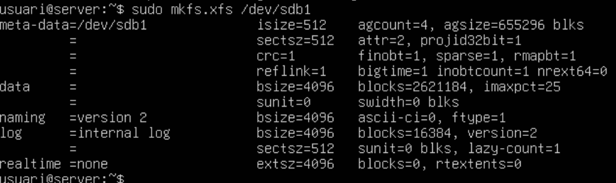

Despres ficarem el format XFS amb aquesta comanda

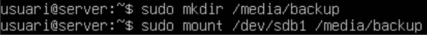

Crearem la carpeta /media/backup per despres muntar-la a la carpeta /dev/sdb1

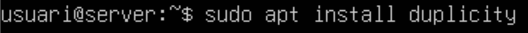

Ara el següent pas serà instal·lar Duplicity

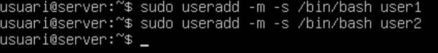

Després creem dos usuaris addicionals amb carpetes personals, que seran user1 i user2

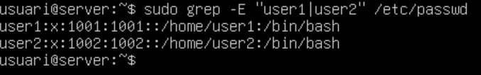

Per comprovar que s’han creat correctament farem

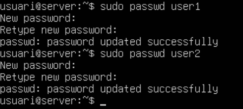

Configurem la contrasenya dels usuaris

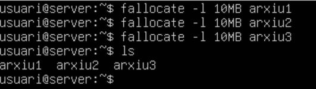

Crearem arxius buits sense propòsit només perquè estiguin allà per poder fer la prova a la carpeta home de l’usuari

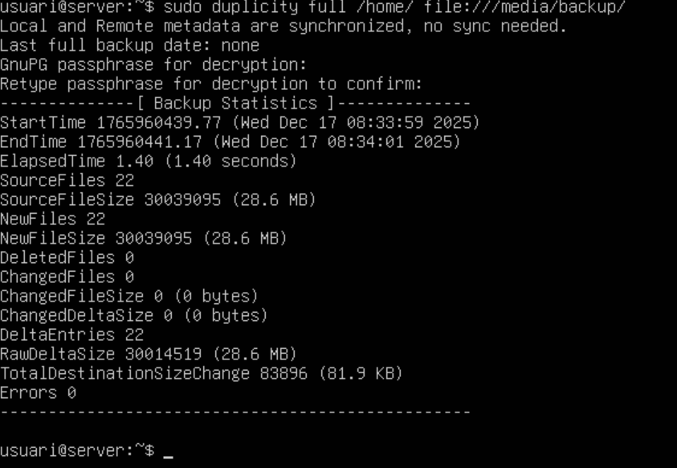

El següent pas es fer la còpia de seguretat de la carpeta /home amb la següent comanda

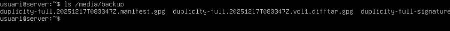

Comprovareem que s'ha creat correctamen

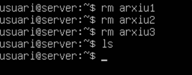

Ara esborrarem els arxius per poder fer la restauració

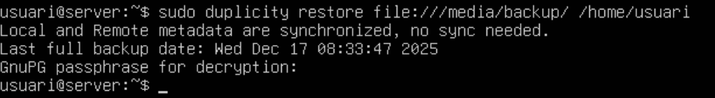

El següent serà fer la restauració del /home de l’usuari

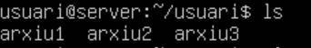

Després crearem un nou fitxer per fer una altra comprovació

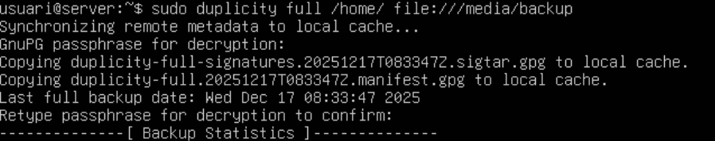

Farem una copia incrementalamb aquesta comanda

Ara desmuntarem /media/backup

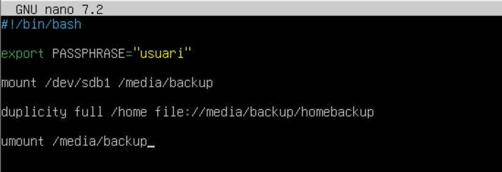

Ara crearem un script amb bin/bash que farà la còpia completa de /home de l’usuari principal

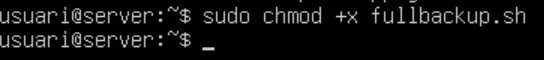

Després li donarem permisos d’execució perquè si no no podrem executar-lo

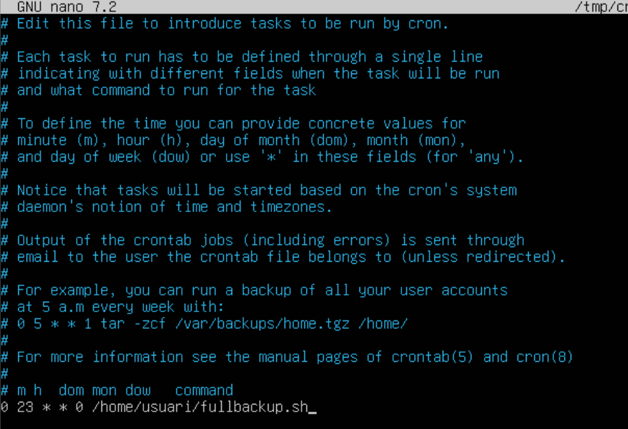

Programem al cron com a root l’execució de l’script els diumenges a les 23:00

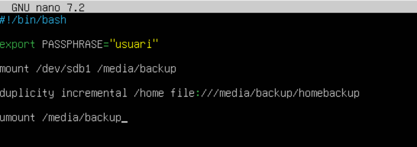

creem un altre arxiu executable de bin/bash, que sigui l’incremental

Donarem també els permisos amb chmod.

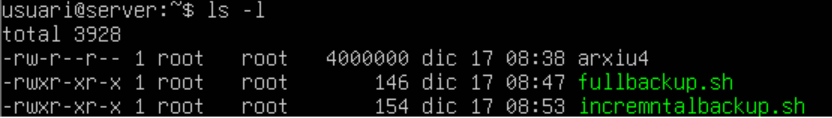

Comprovem que s'han creat correctament

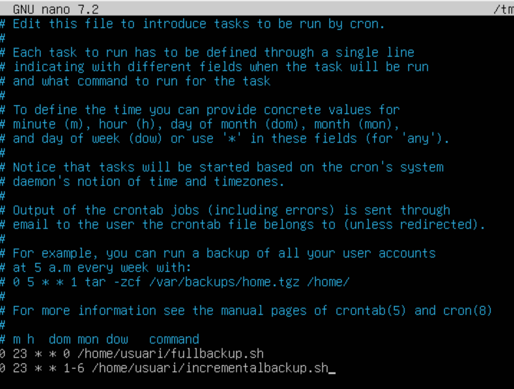

Executem el programa cron per configurar que es repeteixi a les 23 hores
