## T06: Accés remot. Escriptori remot (RDP)

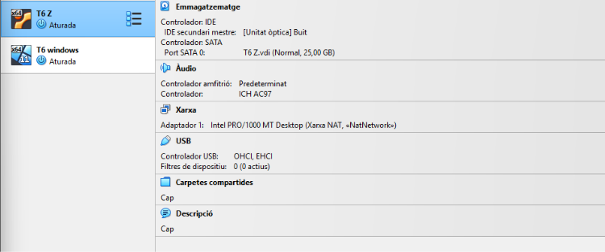

Primer de tot haurem de configurar les 2 màquines tant Ubuntu com Windows en xarxa nat,

Després en entrar a Windows anirem a configuració, a l’apartat de sistema i activarem escriptori remot, i entrem a Usuaris d'Escriptori Remot per a dir-li a la màquina quin usuari podrà connectar-se remotament.

Li donarem a agregar

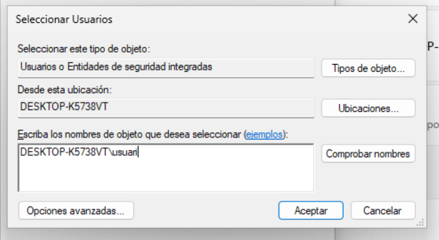

Aquí hem de posar el mateix que apareix a l’apartat des d’aquesta ubicació, això s’escriu on diu escriviu els noms d’objecte que voleu seleccionar, afegint-hi una barra i el nom de l’usuari de la màquina Windows.

Li donarem a acceptar

I ja ens apareix als usuaris d’escriptori remot

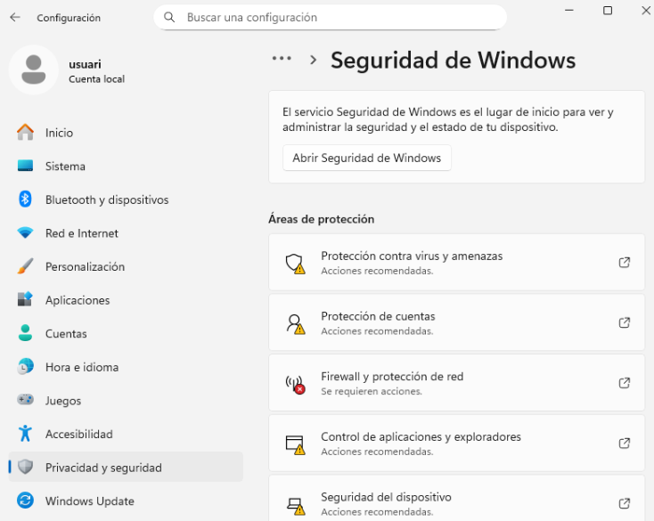

Després desactivarem el firewall

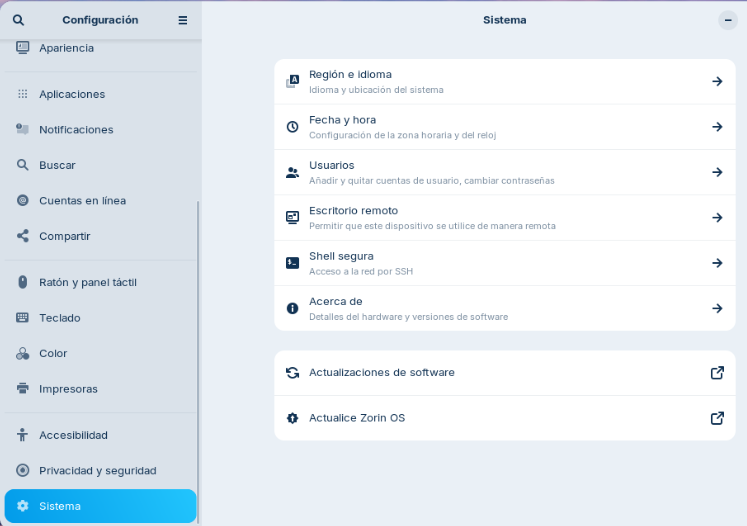

Un cop iniciada la màquina Zornin, anirem a configuració i a l’apartat d’escriptori remot,

I activarem les dues opcions.

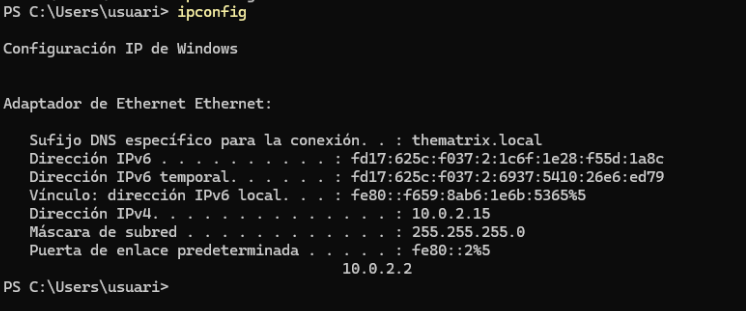

Mirarem la IP de la nostra màquina de Windows amb ipconfig

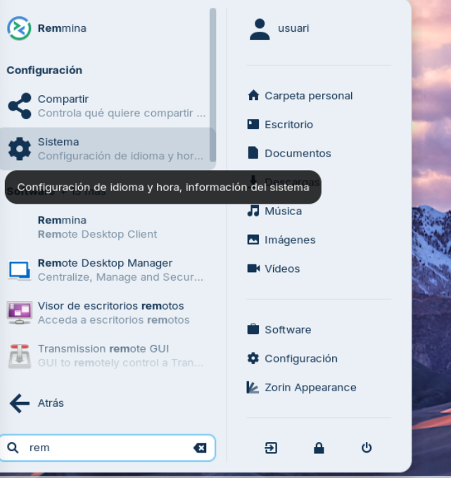

Després obrirem l’aplicació d’escriptori remot de Linux que és remmina

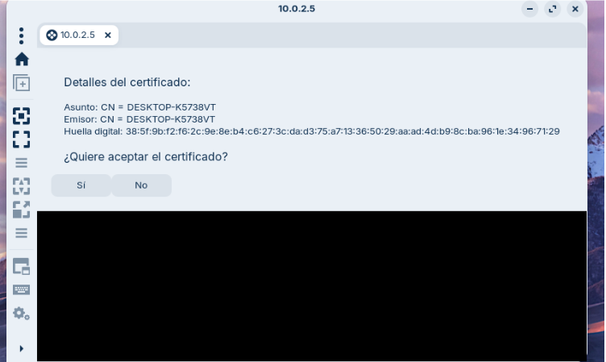

Aquí només li hem de donar a què si

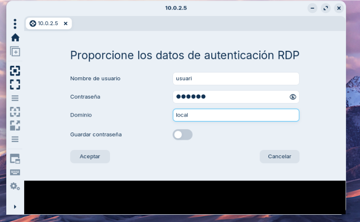

Posarem el nom i la contrasenya de Windows, i li donarem a acceptar

I ja estaria, ja ens podríem connectar a la màquina de Windows.

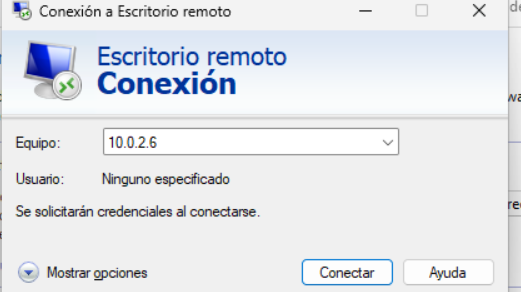

Després a la màquina de Windows, posarem l’IP de la nostra màquina de Zornin a la seva aplicació d’escriptoris remots.

I haurem d'recordar-nos del nom d’usuari i la contra de la màquina Zornin.

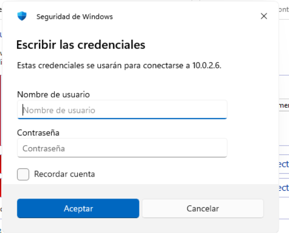

I aquí posarem les dades mencionades anteriorment.

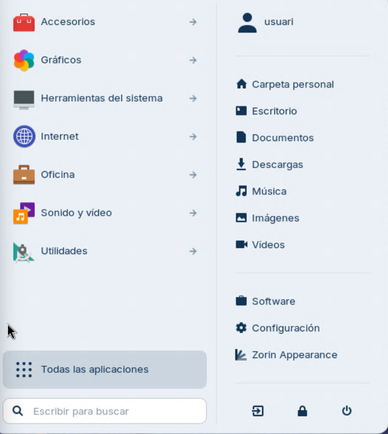

I ja tindríem accés des de Zornin a Windows.

