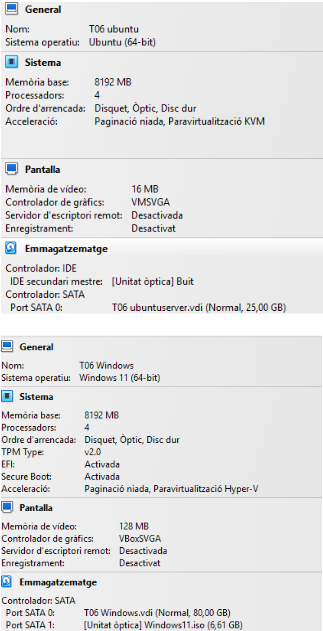

# Fase 1

## Comparativa d’eines d’accés remot

| Eina | Facilitat d’ús | Sistemes on funciona | Limitacions | Preu |
|-----|---------------|---------------------|-------------|------|
| **TeamViewer** | Requereix instal·lació, però el procés és senzill. El client només ha de compartir un ID i una contrasenya, cosa que facilita molt la connexió fins i tot a persones amb poca experiència. | Windows, macOS, Linux, Android i iOS | Pot tallar sessions si detecta “ús comercial”. Necessita instal·lació. Versions antigues poden fallar. Consumeix més recursos que altres. | 32,90 € |
| **AnyDesk** | Molt lleuger i ràpid. Pot funcionar sense instal·lar, i el client només ha de proporcionar un codi. És intuïtiu i pràctic per a usuaris amb poca experiència. | Windows, macOS, Linux, Android i iOS | Algunes funcions requereixen instal·lar-lo. No funciona des del navegador. Versions antigues poden donar errors. En Linux pot requerir permisos extra. | 97,11 € |
| **Google Remote Desktop** | Extremadament fàcil d’utilitzar. Només cal instal·lar una extensió de Chrome i accedir amb el compte de Google. Ideal per a usuaris que no volen complicacions. | Qualsevol sistema amb navegador Chrome: Windows, macOS i Linux | Només funciona amb Chrome. No té xat ni funcions avançades. Transferència d’arxius molt limitada. Necessita compte de Google. | 0,00 € |
| **Remmina** | Pensat principalment per a Linux. Permet connectar-se via RDP, VNC, SSH i altres protocols. És potent, però pot requerir més configuració si l’usuari no està acostumat a entorns Linux. | Principalment Linux (Ubuntu, Debian, Fedora, etc.). També es pot compilar o instal·lar en altres sistemes, però no està orientat a Windows o macOS. | No és nadiu per a Windows o macOS. Requereix coneixements bàsics de xarxes i protocols. No és tan intuïtiu per a usuaris novells. La qualitat i funcions depenen del protocol utilitzat (RDP, VNC, SSH). | 0,00 € |

---

# Fase 2: Remmina

Remmina és una eina gratuïta i segura que serveix com a client d’accés remot, especialment orientada a sistemes Linux. Permet als usuaris accedir i controlar un ordinador Linux o Windows de manera remota.

## Passos per realitzar l’assistència remota

1. Configuro les dues màquines en una xarxa **NAT**.

2. Configuro la màquina client **Windows** i una màquina host **Zorin** i habilito el sistema d’escriptori remot.

3. Creo un usuari que tindrà permisos per accedir remotament.

4. Des de **Zorin**, utilitzo **Remmina** per accedir al control remot del sistema.

5. Introdueixo un nom d’usuari.

6. Inicio sessió amb l’usuari i la contrasenya prèviament creats des de la màquina Windows.

7. Visualitzo la pantalla de la màquina client **Windows** des de la màquina host **Zorin**.

