## Fase 1

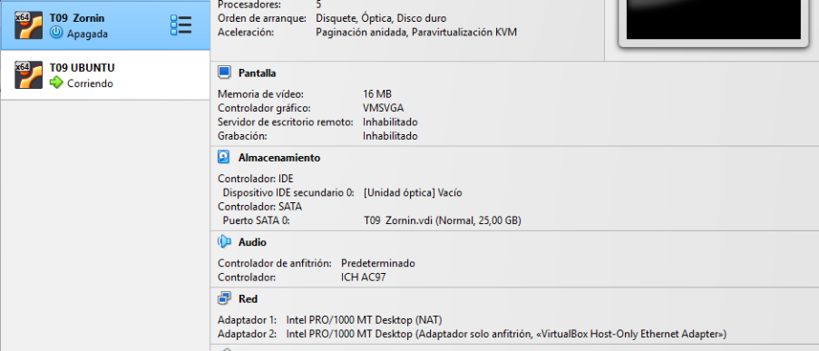
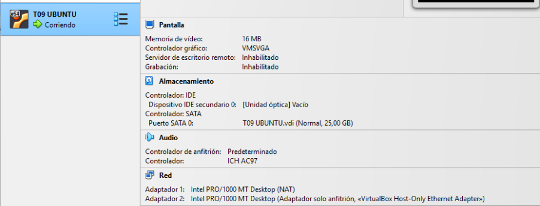

Primer configurarem les interfícies de les dues màquines, i afegirem una interfície en xarxa només amfitrió

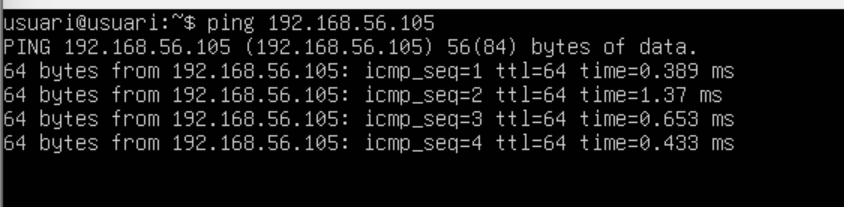
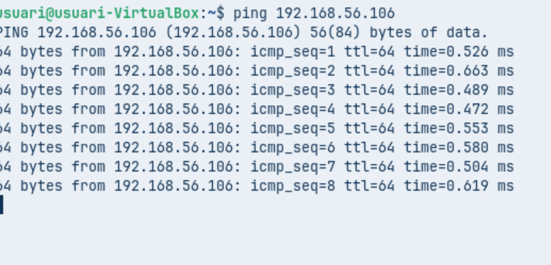

Després comprovarem la connectivitat entre les dues màquines, i
per últim farem sudo apt update && sudo apt upgrade

## Fase 2

Primer crearem 2 grups, un que és dirà admins i un altre devs.

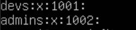

I comprovem que s’han creat correctament

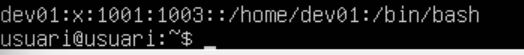

Crearem 2 usuaris, el primer serà dev01 i l’afegirem a devs

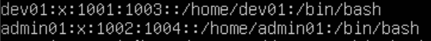

I el segon és dirà admin01 i l’afegirem a admins, en els 2 casos comprovarem que els hem creat.

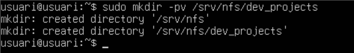

Ara creem un directori per als projectes

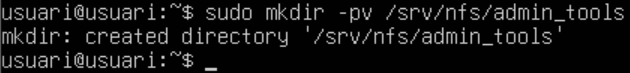

I un altre per a les eines d’administració

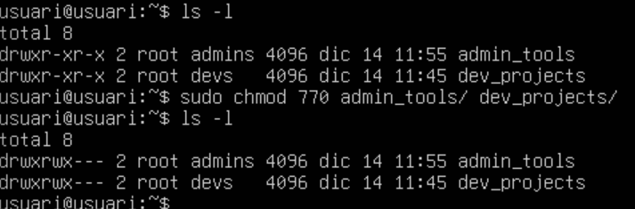

Modifiquem els permisos perquè els desenvolupadors tinguin control total dels seus projectes i els administradors tinguin control de les seves eines.

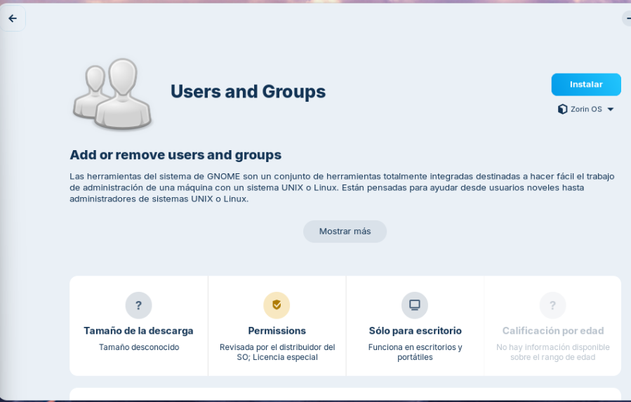

Després a la màquina zornin instal·larem l’aplicació users and groups

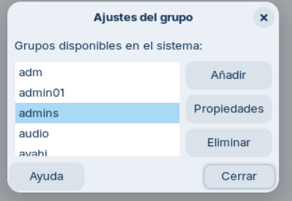

Crearem els mateixos usuaris i grups que al servidor, mantenint els mateixos UID i GID, per fer-ho, anirem a manage groups i crearem els grups devs i admins.

fiquem el nom del primer grup devs amb GID 1001

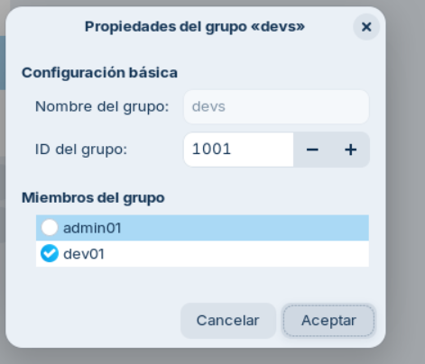

I segon grup admins amb GID 1002

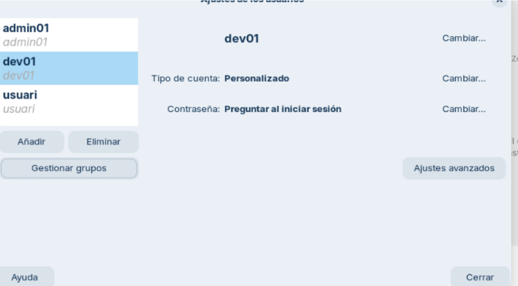

I afegirem els usuaris amb el mateix uid i els assignarem les contrasenyes, i afegir-los als grups corresponents

instal·larem el servidor NFS 

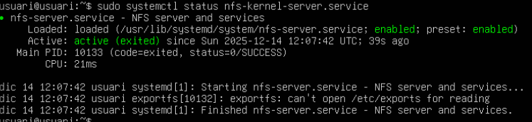

I comprovarem que està tot instal·lat correctament

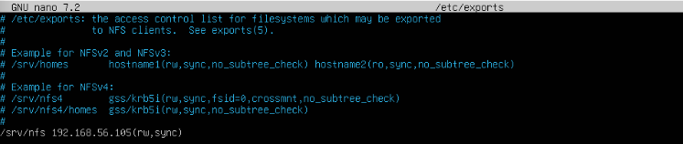

Ara caldrà configurar l'exportació dels directoris i afegir ls següent línia /srv/nfs 192.168.56.105(rw,sync)

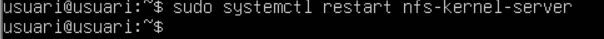

I quan estigui configurat, reiniciem el servei

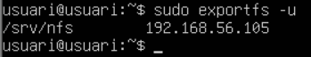

I comprovem què estem compartint 

sudo apt install nfs-common -y

Ara cal instal·lar el client NFS al Zorin

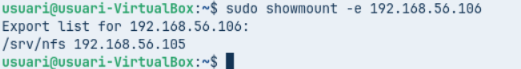

Comprovarem que té accés al recurs del servidor i que el pot veure correctament. I

Ara ja podem mapar la carpeta, però abans l’hem de crear amb la comanda sudo mkdir /srv/remot
sudo mount -t nfs 192.168.56.106:/srv/nfs /srv/remot
Ara per poder accedir al recurs, haurem d’utilitzar la comanda mount

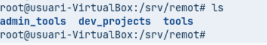

I ja podrem veure que la carpeta del servidor

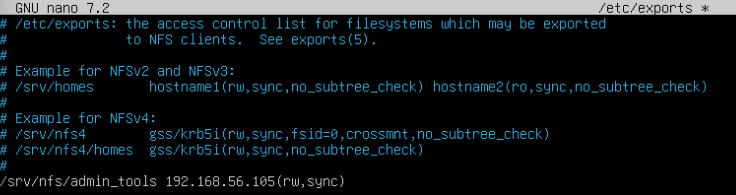

El client necessita que el directori /srv/nfs/admin_tools sigui accessible per l’equip d’administradors, per això que exportarem el directori /srv/nfs/admin_tools amb les opcions rw,sync com es pot veure a la captura.

sudo systemctl restart nfs-kernel-server

I tornarem a reinciar el servei.

sudo mkdir /mnt/admin_tools

Ens dirigim al client i ja podem mapejar la carpeta, però haurem de crear-la primer.

I per a poder accedir al recurs, haurem d'utilitzar la comanda mount per a muntar la unitat a /mnt/admin_tools
Root squash

Quan intentem accedir a /mnt/admin_tools com a root, no ens deixa perquè en NFS l’opció root_squash està activada. Això fa que el root del client passi a ser nobody, i per tant no pot modificar fitxers amb permisos de superusuari al servidor.

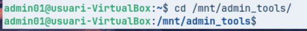

Amb l’usuari admin01 sí que podem accedir, perquè forma part del grup propietari de la carpeta admins.

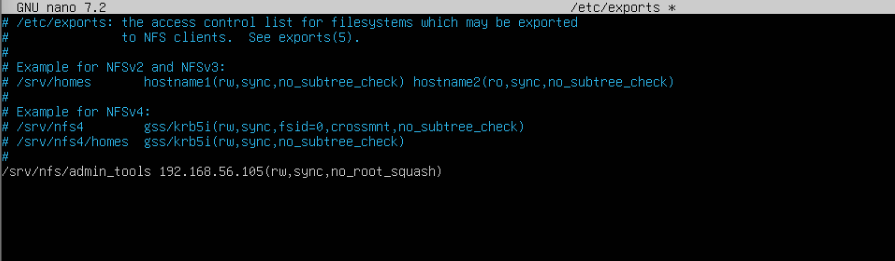

Per solucionar-ho, hem de configurar l’exportació del directori srv nfs admin tools amb l’opció no root squash, haurem de tornar a modificar l’arxiu exports i afegir l’opcio no root squash de la mateixa manera que a la captura, i tornarem a reiniciar el servei.

I muntem i desmuntem la unitat al client

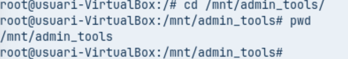

I podem veure que ja podem accedir com a root 

## Fase 4

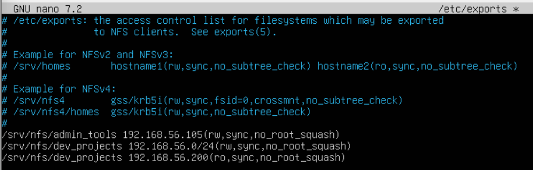

Editarem /etc/exports per afegir dues exportacions del mateix directori: la xarxa d’administració 192.168.56.0/24 tindrà permís d’escriptura, mentre que l’equip de consultors amb IP 192.168.56.200 només podrà llegir.

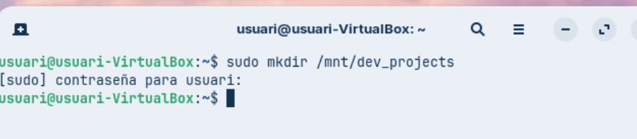

Una vegada a dins del client, haurem de mapejar la carpeta, però haurem de crear-la primer

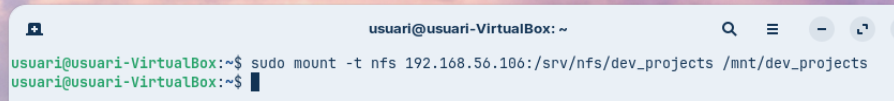

Apliquem i guardem els canvis, després muntem els recursos a la carpeta /mnt/dev_projects.

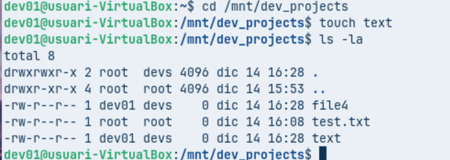

Després entrarem a la carpeta projects, i crearem un arxiu de prova, i si quan realitzem la comanda ls i ens surt que s’ha creat està tot correcta.

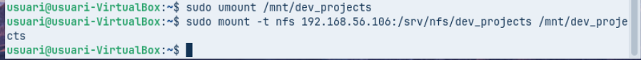

Desmuntem el recurs i canviem manualment la IP del client a 192.168.56.200, després tornem a provar d’escriure al directori muntat com a usuari dev01 i comprovem que només permet la lectura.

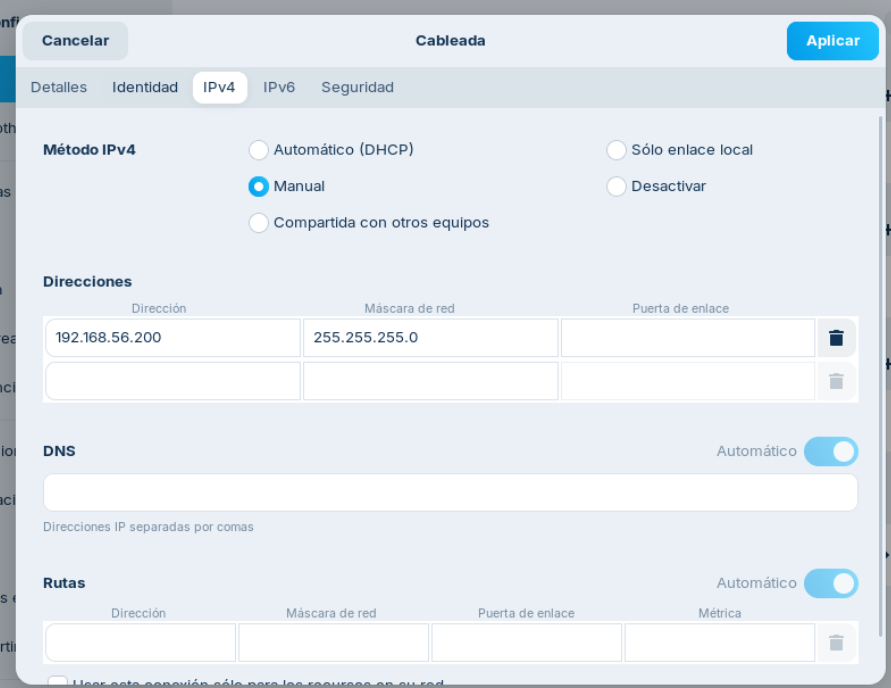

Com es pot veure aqui l’ip ara es 200

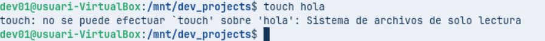
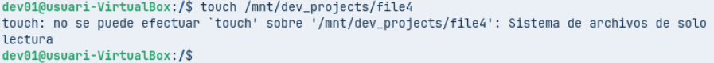

I com podem comprovar no ens deixara crear cap arxiu.

## Fase 5

sudo nano /etc/fstab

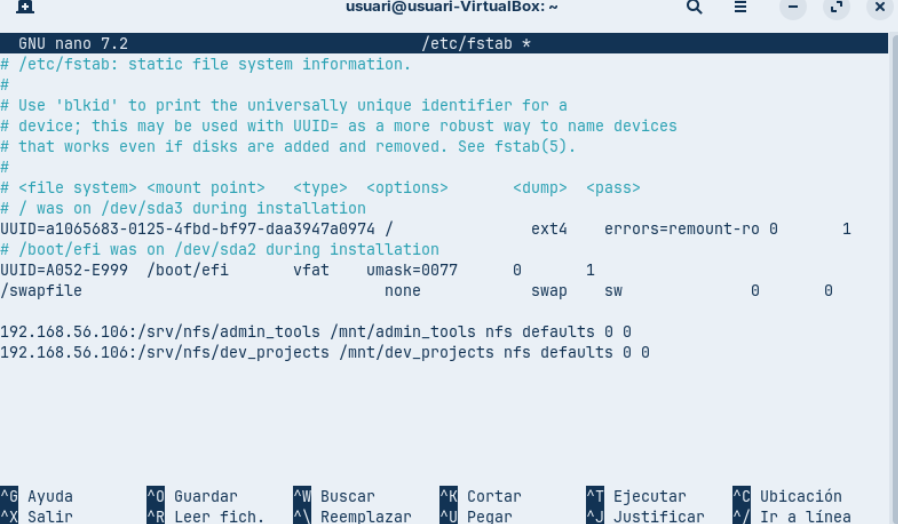

Com que els usuaris no poden muntar els recursos cada cop que reinicien, es farà el muntatge automàtic amb el fitxer /etc/fstab al client

I Per últim farem sudo mount -a, y reiniciarem al màquina, i quan intentem entrar dintre de dev_projects ho admin_tools com usuari en hauria de denegar la possibilitat d’accedir.

## Conclusió

Hem fet la pràctica amb NFS i hem vist que és útil per compartir recursos entre servidor Ubuntu i client Zorin. Permet gestionar usuaris, grups i xarxes, però té un inconvenient: cal crear els mateixos usuaris i grups amb els mateixos UID i GID a totes les màquines. En una empresa amb molts equips això no és escalable, ja que s’hauria de repetir la configuració a cada ordinador i al servidor

